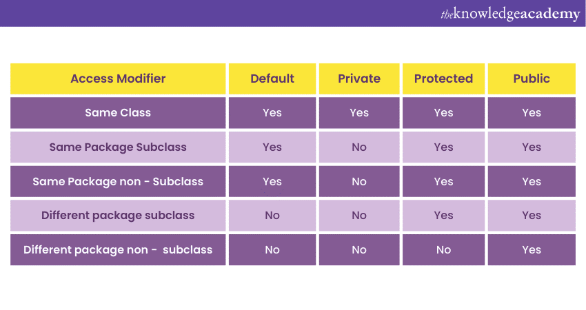

## This is the java documentation created for my own.

### Array and ArrayList :

* Size is not fixed ,
* Resizable,
* array.size() to know the length of the arrayList.
* Arraylist is a container that holds a collection of object, and in Java everything is an object. i.e : String,
  integer .
* Typically, you want your ArrayList to hold a specific type of object (e.g., only String objects). This is where
  generics come in.
  When you write ArrayList<String>, you’re telling Java that this ArrayList should only hold String objects.
  Even though you specify a type, under the hood, ArrayList is still working with Object. The difference is that
  Java
  knows what kind of Object it should expect, so it can enforce type safety and prevent you from accidentally adding
  the
  wrong type of object.

```java
ArrayList<String> arr = new ArrayList<>(); // arr can only hold String objects

ArrayList arr = new ArrayList(); //In this statement, no type is specified within the angle brackets (<>). This means the ArrayList can hold objects of any type (it becomes a raw type), but this practice is discouraged because it can lead to issues with type safety.
```

### Stack and Heap

- **Heap Memory**: Stores objects and instance variables. Managed by the garbage collector. Larger and globally
  accessible. Slower than stack memory.

- **Stack Memory**: Stores method calls, local variables, and references to heap objects. Automatically managed (LIFO).
  Smaller, faster, and method-specific.

### Varargs

**VarArgs in JAVA is the same as the REST PARAMETERS in Javascript.**

Varargs in Java allows you to pass a variable number of arguments to a method. It is defined
using `dataType... parameterName`, and the arguments are treated as an array within the method. This enables flexibility
in method calls without overloading.

### Example:

```java
static void showValues(int... numbers) {
    // Process numbers as an array
}
```

**Key Point**: Varargs must be of the same type and can simplify method calls.

### Iteration VS Recursion

#### **Iteration**:

- A process where a loop repeatedly executes a block of code until a condition is met.
- Uses less memory since it doesn't create new function calls.
- Generally faster and more efficient for simple tasks.
- Using a `for` loop to calculate a sum.

#### **Recursion**:

- A process where a function calls itself to solve smaller subproblems.
- Uses more memory due to multiple function calls stacked on top of each other.
- Can be cleaner and easier to understand for complex problems (like tree traversals).
- Calculating a factorial by calling the function repeatedly.

# Object Oriented Programming

1. **Encapsulation**: Hide details, use getters and setters.
2. **Inheritance**: One class inherits from another.
3. **Polymorphism**: Methods behave differently based on the context.
4. **Abstraction**: Hide complex details, only show important parts.

### 1. **Encapsulation**

Encapsulation is about keeping the details (variables) hidden and only allowing access to them through methods (getters
and setters). It helps protect the data from being changed directly.

**Example:**

```java
class Person {
    private String name;  // private variable, can't be accessed directly

    // Getter method
    public String getName() {
        return name;
    }

    // Setter method
    public void setName(String name) {
        this.name = name;
    }
}

public class Main {
    public static void main(String[] args) {
        Person person = new Person();
        person.setName("Naymur");  // Set the name using the setter method
        System.out.println(person.getName());  // Get the name using the getter method
    }
}
```



### 2. **Inheritance**

Inheritance allows a class to inherit properties and methods from another class. The class that inherits is called a
child class, and the class being inherited from is the parent class.

There are **4 types of inheritance**.

1. **Single inheritance**: A class inherits from only one parent class. For example, if class `B` inherits from
   class `A`, it is called single inheritance.

2. **Multilevel inheritance**: A class inherits from a parent class, and then another class inherits from that child
   class. For example, if class `C` inherits from class `B`, and class `B` inherits from class `A`, this is multilevel
   inheritance.

3. **Hierarchical inheritance**: Multiple classes inherit from the same parent class. For example, if both class `B` and
   class `C` inherit from class `A`, it is hierarchical inheritance.

**Example:**

```java
class Animal {
    public void eat() {
        System.out.println("This animal is eating");
    }
}

// Dog class inherits from Animal class
class Dog extends Animal {
    public void bark() {
        System.out.println("The dog is barking");
    }
}

public class Main {
    public static void main(String[] args) {
        Dog dog = new Dog();
        dog.eat();  // Inherited method
        dog.bark();  // Method from Dog class
    }
}
```

### 3. **Polymorphism**

Polymorphism means "many forms." In Java, it allows methods to have different implementations depending on the object
type or how they're called. There are two types: **_method overloading_** (same method name, different parameters) and *
*_method
overriding_** (child class redefines a method from the parent class).

**Example of Method Overloading:**

```java
class Calculator {
    // Same method name, but different parameter types
    public int add(int a, int b) {
        return a + b;
    }

    public double add(double a, double b) {
        return a + b;
    }
}

public class Main {
    public static void main(String[] args) {
        Calculator calc = new Calculator();
        System.out.println(calc.add(2, 3));  // Calls the int version
        System.out.println(calc.add(2.5, 3.5));  // Calls the double version
    }
}
```

**Example of Method Overriding:**

```java
class Animal {
    public void sound() {
        System.out.println("This animal makes a sound");
    }
}

class Dog extends Animal {
    // Overriding the sound method
    @Override
    public void sound() {
        System.out.println("The dog barks");
    }
}

public class Main {
    public static void main(String[] args) {
        Animal myDog = new Dog();  // Animal reference, Dog object
        myDog.sound();  // Calls the Dog's sound method
    }
}
```

### 4. **Abstraction**

Abstraction hides the complexity by showing only the necessary details. In Java, it can be achieved using abstract
classes or interfaces. You can't create an object of an abstract class, only extend it.

**Example using Abstract Class:**

```java
abstract class Animal {
    // Abstract method (no body)
    public abstract void sound();

    // Regular method
    public void sleep() {
        System.out.println("This animal is sleeping");
    }
}

class Dog extends Animal {
    // Providing body for the abstract method
    public void sound() {
        System.out.println("The dog barks");
    }
}

public class Main {
    public static void main(String[] args) {
        Dog dog = new Dog();
        dog.sound();  // Calls the abstract method's implementation
        dog.sleep();  // Calls the regular method
    }
}
```

## SUPER (Keyword)

In Java, the **`super`** keyword is used to refer to the parent (superclass) of an object. It is primarily used in two
situations:

1. **Calling the parent class constructor**: You can use `super()` to call the constructor of the parent class from the
   subclass constructor, ensuring that the parent class is initialized before the child class.

2. **Accessing parent class methods or variables**: If the subclass overrides a method or variable from the parent
   class, `super.methodName()` or `super.variable` allows you to access the parent class version instead of the subclass
   version.

**Example**: super variable, super method, super constructor.

```java
class Parent {
    String name;

    // Parent class constructor
    Parent(String name) {
        this.name = name;
        System.out.println("Parent constructor called. Name: " + name);
    }

    // Parent class method
    void display() {
        System.out.println("Parent method called. Name: " + name);
    }
}

class Child extends Parent {
    String name;  // Child class has its own 'name' variable

    // Child class constructor
    Child(String childName, String parentName) {
        super(parentName);  // Calls the Parent class constructor
        this.name = childName;
        System.out.println("Child constructor called. Child Name: " + childName);
    }

    // Overriding Parent's method
    @Override
    void display() {
        super.display();  // Calls Parent class method
        System.out.println("Parent Name using super: " + super.name);  // Accesses Parent's name variable
        System.out.println("Child method called. Child Name: " + name);
    }
}

public class Main {
    public static void main(String[] args) {
        // Creating an instance of Child class
        Child child = new Child("Naymur Jr.", "Naymur Sr.");

        // Calling the display method
        child.display();
    }
}

```

## THIS (Keyword)
